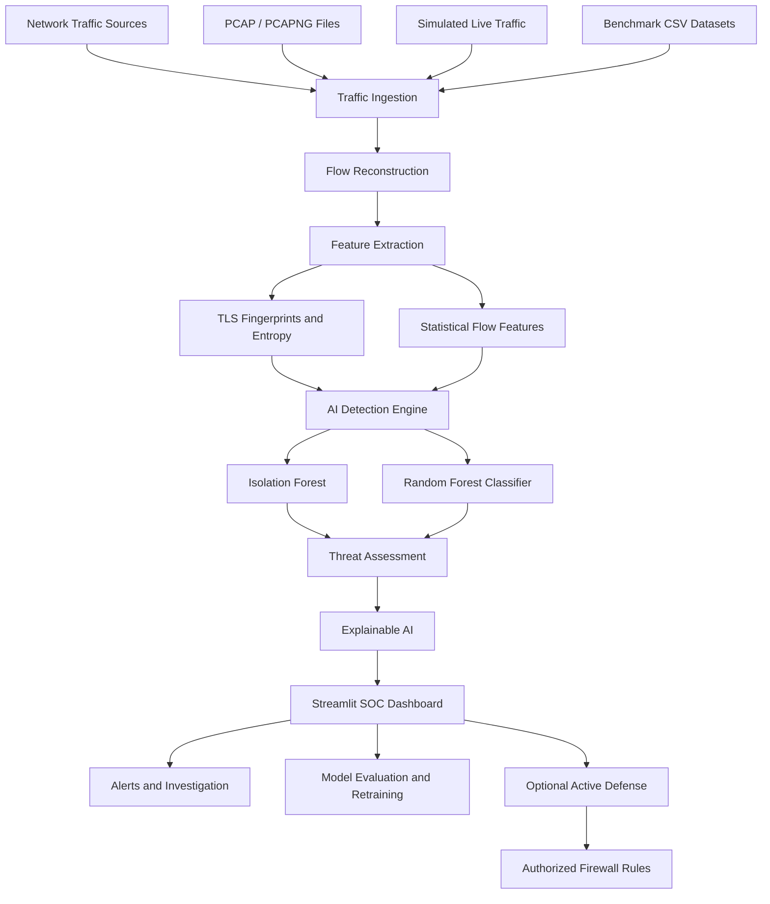

AI-Powered Automated Threat Detection & Real-Time Anomaly Analysis in Encrypted Network Traffic
OPCODE IMPACT 2026 | Hackathon Submission
Team ID: OPC038
1. Problem Statement
Modern organizations rely heavily on encrypted network protocols such as HTTPS, TLS 1.2/1.3, SSH, DNS-over-HTTPS (DoH), and Tor. Although encryption protects privacy and sensitive information, it also makes it difficult for traditional security systems to identify malicious activities hidden within encrypted communication.
Threats such as Command and Control (C2) beaconing, data exfiltration, covert tunneling, proxy abuse, and denial-of-service attacks can remain undetected when security monitoring relies primarily on packet payload inspection.
Our project addresses this challenge by analyzing encrypted network traffic using statistical flow characteristics, packet timing patterns, cryptographic fingerprints, and machine learning without requiring payload decryption.
2. Solution Title
AI-Powered Automated Threat Detection & Real-Time Anomaly Analysis in Encrypted Network Traffic
An AI-assisted Encrypted Traffic Analytics (ETA) and Security Operations Center (SOC) platform designed to detect suspicious network behavior while preserving the confidentiality of encrypted payloads.
3. Solution Description
Our solution combines Isolation Forest for anomaly detection and Random Forest for supervised threat classification. It analyzes network flow features such as packet lengths, forward and backward byte counts, inter-arrival times, traffic asymmetry, and available TLS fingerprints to identify potentially malicious communication without decrypting payloads.
The platform supports analysis through PCAP/PCAPNG files, benchmark datasets, and simulated real-time traffic streams, depending on the implemented data source. A Streamlit dashboard enables users to visualize traffic, investigate suspicious flows, review detection explanations, and evaluate model performance. The proposed active-defense functionality includes IP quarantine management and firewall-rule generation, where implemented and tested.
Key Features
Dual-stage AI detection using Isolation Forest and Random Forest.
Encrypted traffic analysis without application-payload decryption.
Seven intended traffic categories: benign web, benign streaming, C2 beaconing, data exfiltration, Tor proxy tunneling, DoH data tunneling, and TLS flooding.
Statistical flow feature extraction and available TLS fingerprint analysis.
Explainable threat alerts.
PCAP/PCAPNG forensic analysis.
Dataset exploration, model evaluation, and retraining support.
Streamlit-based security dashboard.
Optional active defense and firewall-rule generation.
4. Architecture Diagram

Workflow Explanation
Traffic Ingestion: Accepts supported PCAP/PCAPNG files, benchmark datasets, or simulated traffic streams.
Flow Reconstruction: Groups individual packets into bidirectional network flows based on 5-tuple metrics.
Feature Extraction: Calculates statistical metrics, packet timing distributions, direction ratios, entropy, and available TLS fingerprints.
AI Detection: Isolation Forest identifies statistical anomalies, while Random Forest classifies flows into predefined threat categories.
Explainable Analysis: Generates human-readable explanations and attribution breakdowns for detected threats.
Dashboard Visualization: Displays interactive charts, real-time security alerts, and deep forensic inspection views.
Response and Mitigation: Enables model evaluation/retraining along with optional automated firewall rule generation and IP quarantining.
5. Technology Stack
Frontend: Streamlit, Plotly
Backend: Python
Machine Learning: Scikit-learn (Isolation Forest, Random Forest Classifier)
Data Processing: Pandas, NumPy
Network Analysis: Scapy
Model Persistence: Joblib
Database / Storage: CSV benchmark storage
Security & Forensic Tools: TLS JA3 fingerprinting, Shannon entropy analysis, MITRE ATT&CK mapping
6. Quick Start Guide
Prerequisites
Python 3.10 or later
`pip` package manager
Windows, Linux, or macOS
Installation & Execution
Open the project directory:
```bash
   cd AI_Threat_Detection
   ```
Create and activate a virtual environment:
Windows:
```bash
     python -m venv .venv
     .venv\Scripts\activate
     ```
Linux/macOS:
```bash
     python3 -m venv .venv
     source .venv/bin/activate
     ```
Install dependencies:
```bash
   python -m pip install --upgrade pip
   python -m pip install streamlit scikit-learn pandas numpy scapy plotly joblib aiohttp
   ```
Run the dashboard application:
```bash
   streamlit run app.py
   ```
Open `http://localhost:8501` in your browser.
Run automated tests (optional):
```bash
   python test_detection.py
   ```
7. Output Screenshots
1. Main SOC Control Console & Real-Time Incident Stream

> *Displays the real-time security incident stream, Inter-Arrival Time jitter coefficient vs Producer-Consumer ratio plot, anomaly sensitivity controls, and active threat detection alerts (DoH Data Tunneling, C2 Beaconing).*
2. Benchmark Datasets & AI Model Training Lab

> *Provides benchmark dataset metrics (7,000 flow samples, 61.4% malicious share), dataset selection, threat class breakdown, and AI model training lab statistics.*
3. Interactive Threat Simulator & Parameter Tuning

> *Enables interactive parameter tuning for session duration, total packet count, forward/outbound ratios, mean packet length, inter-arrival time jitter, and cryptographic TLS attributes (SNI domain, JA3 fingerprint).*
4. Explainable AI Evaluation & Deep Flow Forensic Inspector

> *Deep-dives into network 5-tuples, cryptographic TLS details, JA3 signature matches (e.g., Chrome/Win11 ClientHello), anomaly score calculation, and explainable AI (XAI) attribution breakdowns.*
5. Live Network Traffic & Latency Guard

> *Monitors real-time operational performance metrics, including throughput, P50/P95/P99 latency curves, queue depths, request loads, and shed request counts.*
8. Future Scope
Live Stream Ingestion: Integrate asynchronous packet capture drivers for high-throughput live network environments.
Scalability Enhancements: Implement batching and distributed processing pipelines for enterprise network traffic.
Model Evaluation: Expand quantitative benchmarking across larger multi-source encrypted datasets.
Governance & SOAR: Add role-based access control (RBAC), approval workflows, audit trails, and automated firewall policy rollback mechanisms.
Persistence & Monitoring: Incorporate dedicated database storage for historical alerts and continuous drift monitoring for model retraining.
9. Team Contributions
Member Name	Contribution
Sayooj S Nair	Machine learning model development, anomaly detection algorithms, and threat classification engine.
Neha Fathima M	Feature extraction, PCAP/PCAPNG network traffic analysis, dataset preparation, and automated testing.
Rena Sherin M A	Streamlit dashboard development, interactive data visualization, system integration, and documentation.
10. Tools Used
Tool / Platform	Purpose / Why Used
Python	Core programming language for network telemetry extraction and ML logic.
Streamlit	Powers the interactive SOC control console and security tools.
Scikit-learn	Implements Isolation Forest and Random Forest algorithms.
Pandas & NumPy	Handles numerical array processing and tabular data extraction.
Scapy	Performs packet parsing, PCAP forensic processing, and header inspection.
Plotly	Generates real-time threat charts and latency graphs.
Joblib	Handles model serialization and dynamic loading.
Team ID: OPC038 | OPCODE IMPACT 2026 Submission
